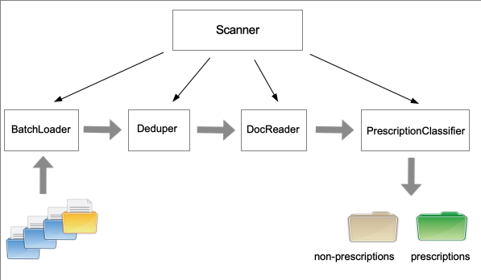

# Prescription Scanner
A utility program to identify prescription refill forms from a collection of documents.

## Usage
```
 python -m prescan <path_to_docs>
 ```

 where <path_to_docs> points to the directory containing all prescriptions to be filtered.  Documents are expected in PDF format.

 ## Background
 Doctors often receive documents from various locations as "e-faxes" - copies of digitally scanned documents wrapped in a PDF document.  Usually these documents are collected at an office and then delivered to a doctor in batches: one batch is a zip file containing hundreds of documents.  The contents of these documents vary greatly, including test results, letters from other doctors and prescription requests.

 It is desirable to be able to categorize documents into two groups: prescription requests and everything else.  The objective of this project is to help doctors streamline this process by automating the identification of prescription documents.

 ## Challenge #1
 Batches are sometimes cummulative, which has the negative effect of producing duplicated documents.  For instance, batch1 may include 100 documents.  A week later a second batch, batch2, is received with 80 documents.  However, 50 documents in batch2 were already present in batch1 - only 30 new documents are of interest.

 Thus, it is necessary to sanitize each new batch, filtering any duplicate documents already received in a previous batch.

 ## Challenge #2
 The documents produced from e-faxes, while in PDF format, are really just images disguised in a PDF costume - they cannot be parsed with a typical PDF library.  Thus, it is necessary to:
 
 1. Convert the PDF to a collection of valid images (one image per page in the document)
 2. Use an OCR library to extract the text from the image, so that it can be parsed

 ## Challenge #3
 While a doctor can easily spot a prescription form from visual inspection of the document, prescription forms vary widely and do not follow a specific pattern.  As a result, the identification process based on textual content is a best-effort approach; while it has shown to produce accurate predictions most of the time, it still isn't perfect.

 ## Design

 The overall workflow can be summarized in the following diagram:

 

 The figure depicts the major abstractions used by this program: 
 
 * a _Scanner_ class orchestrates all the activities;
 * a _BatchLoader_ class loads all documents in memory, keeping track of each document path and its associated batch;
 * a _Deduper_ class filters duplicate documents found in previous batches;
 * a _DocReader_ class converts each PDF document to a collection of images and extracts the document text using OCR;
 * a _PrescriptionClassifier_ class stores the documents from each batch into two separate directories, one for prescriptions and for non-prescription documents.